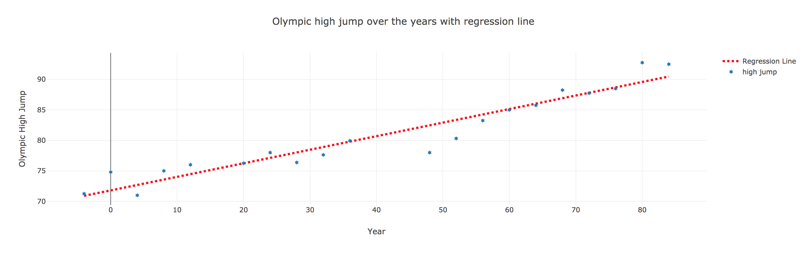

# Regression Analysis

In this activity, you will use the [simplestats](https://simplestatistics.org/) library to calculate a regression function and then plot the line.



## Instructions

* Use the `linearRegression` and `linearRegressionLine` functions from [simplestats.org](https://simplestatistics.org/docs/#linearregressionline) to generate a regression function capable of predicting y values given any x value.

* Use the `min` and `max` year as the x values for the regression line and calculate the predicted y values. Plot this data as trace1 using a dashed line.

* Plot the Olympic High Jump data vs the year as trace2.

## HINT

* You will need to use JavaScript to convert your data into a format that the linearRegression function can accept. Use a loop to parse through the original data and create a new array of arrays consisting of x and y values for the regression model.


```
[[x1, y1], [x2, y2],...,[xn, yn]]
```
