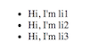
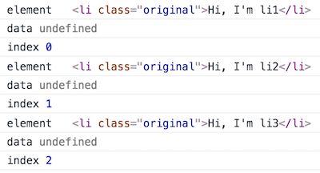
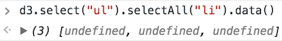
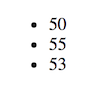
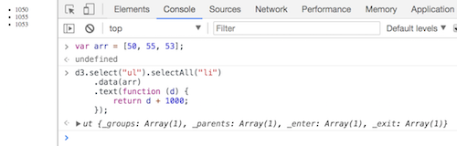
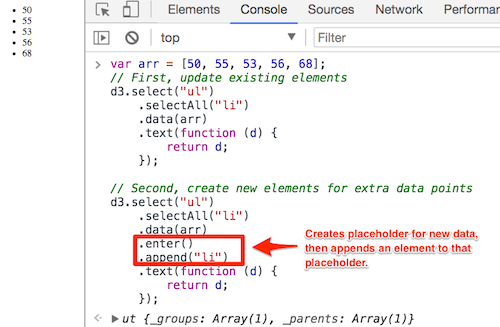
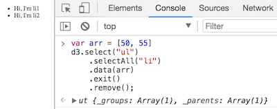
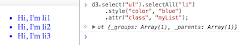
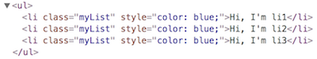

# D3 Reference Guide


## Background

_What is D3?_

D3 stands for Data-Driven Documents; it is a JavaScript library allowing developers to bind arbitrary data to a **D**ocument **O**bject **M**odel. Powerful, data-driven visualizations are created using HTML, CSS, and SVG.

- - -

### Selecting Elements

Selecting different DOM elements requires the use of `.select` and `.selectAll`.

```d3
d3.select("ul").selectAll("li")
```

In the above code, we are using D3 to select all `li` elements inside of a `ul` tag in an HTML document. After execution, the code returns a selection object containing the `li` elements from the DOM.

- - -

### `.each()`

Once elements have been selected, different methods can be chained. The `.each()` method allows us to call a function on each element within the object. This is similar to using `.map()` or `.forEach()` to iterate through an array.

Take this basic webpage, for instance:



We would use the following code to select the list items and iterate through them:

```d3
d3.select("ul").selectAll("li")
  .each(function (d, i) {
    console.log("element", this);
    console.log("data", d);
    console.log("index", i);
  });
```

Now let's break down the code.

* The `.each()` method includes the `(d, i)` parameters; `d` is the data property of the element and `i` is the index in the selector object.

* The keyword `this` is used to log the element.

* Each `console.log` returns the element, data (undefined because we have not bound any to the element yet), and the index position of the element.

  

- - -

### `.data()`

Using the same simple webpage as the example above, we can chain `.data()` to the selector.



In the above image, the current data property is undefined because there is none. Let's change that by adding an array to the mix.

```d3
var arr = [50, 55];
d3.select("ul").selectAll("li").data(arr)
d3.select("ul").selectAll("li").data()
> (3) [50, 55, undefined]
```

Now we have an array, but its length is smaller than the number of elements, resulting in an undefined data property.

```d3
var arr = [50, 55, 53, 56, 68];
d3.select("ul").selectAll("li").data(arr)
d3.select("ul").selectAll("li").data()
> (3) [50, 55, 53]
```

In the above example, the length of the array is more than the number elements in the selector. In this case, the extra items are ignored.

If we provide a new array that is again less than the number of elements, only the new elements are updated.

```d3
var arr = [1, 2];
d3.select("ul").selectAll("li").data(arr)
d3.select("ul").selectAll("li").data()
> (3) [1, 2, 53]
```

- - -

### `.text()`

After data has been bound to an element, there are a variety of functions available to manipulate the elements.

```d3
var arr = [50, 55, 53];

d3.select("ul").selectAll("li")
  .data(arr)
  .text(function (d) {
    return d;
  });

> ut {_groups: Array(1), _parents: Array(1), _enter: Array(1), _exit: Array(1)}
```

Above, we have chained `.text` with a callback function. This callback function is called with each element in the selection. This also changes the element text on our webpage:



The element text can be further modified before assigning new text:



- - -

### `.enter()` & `.append()`

When it comes to handling additional data such as the extra array values above, using `.enter()` will create a sub-selection for data that hasn't been mapped to an element yet. `.append()` will then pair an element to the sub-selection.



- - -

### `.exit()` & `.remove()`

When removing an element based on the number of data properties, `.exit()` will create a selection of the surplus and `.remove()` will remove them from the DOM.



- - -

### `.attr()` & `.style()`

Attributes and styling can be applied with `.attr()` and `.style()`.

 

In the above code, we selected the `li` elements and applied a blue color to the text. Additionally, with `.attr()`, we added a class to each `li` element.
