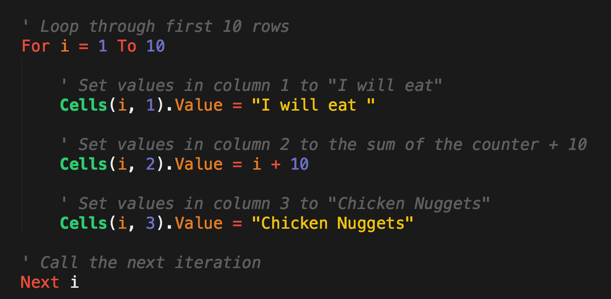
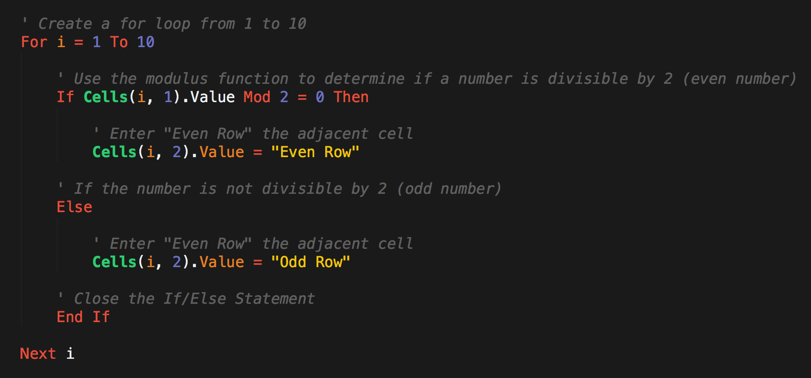
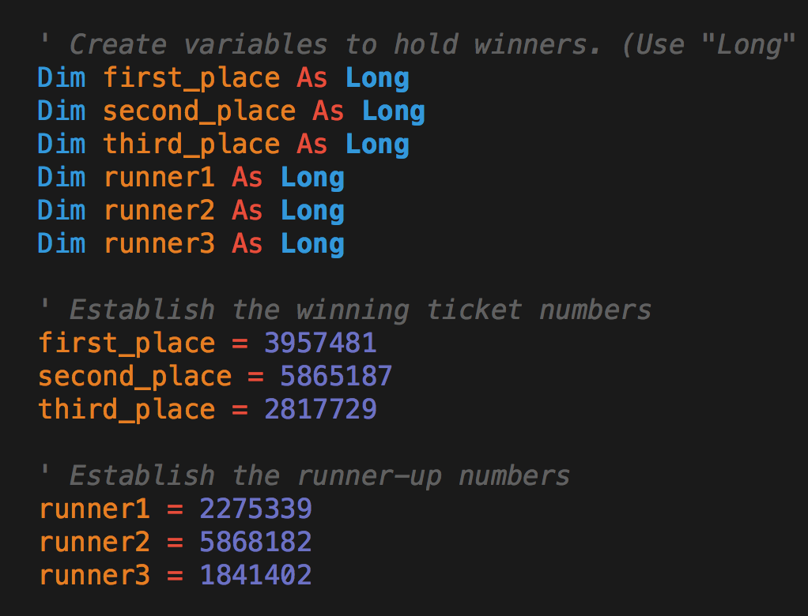
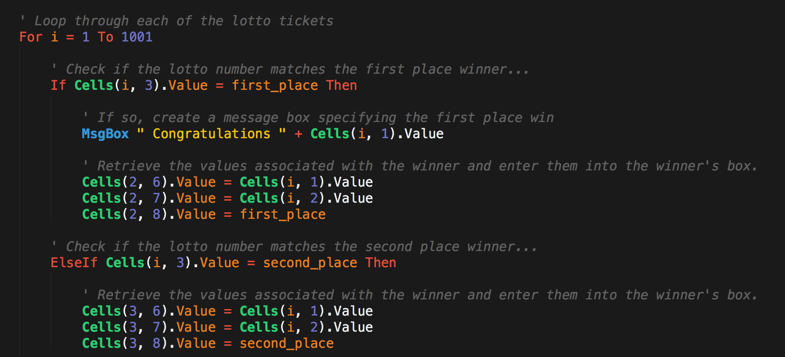
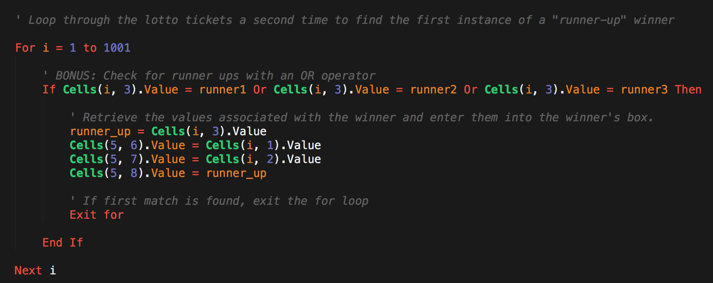
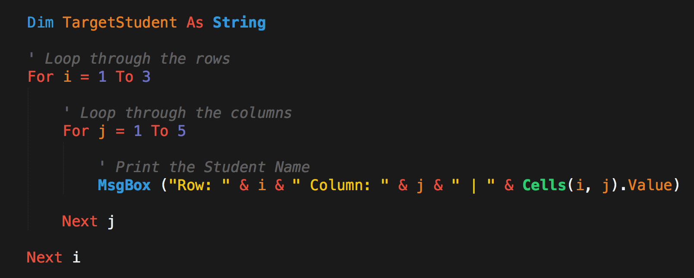
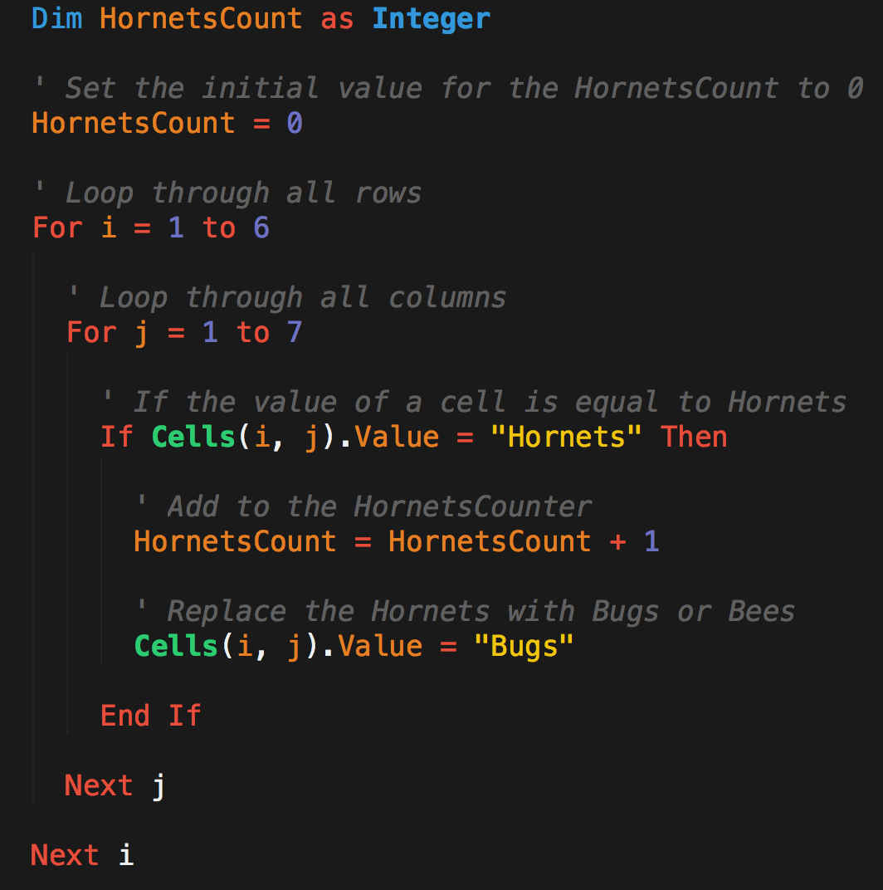
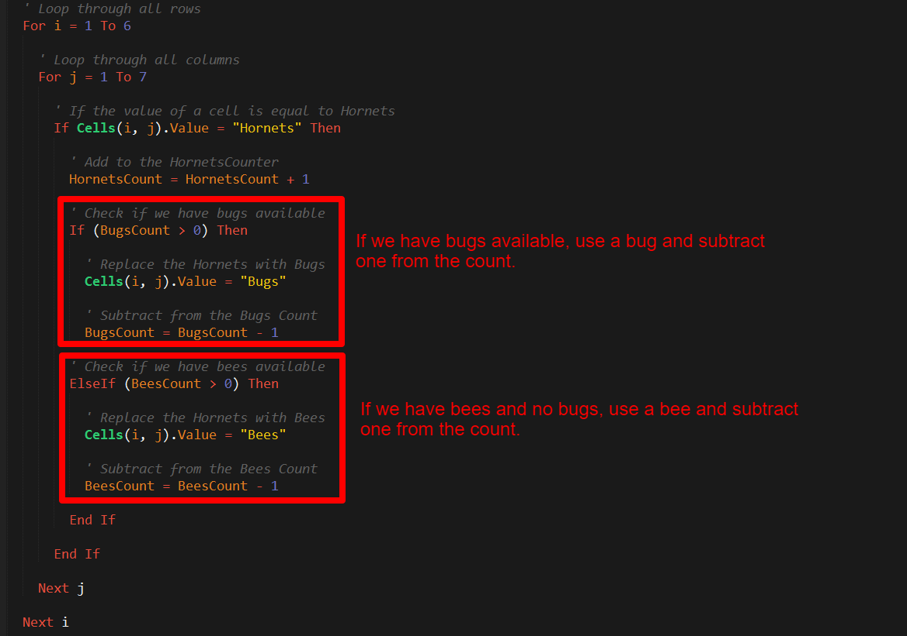

## 2.2 Lesson Plan - Vexing VBA

### Overview

In today's class, students will learn to use basic for-loops and nested for-loops in conjunction with conditionals to complete common coding challenges in VBA.

### Class Objectives

* Students will understand the basic syntax of a VBA for loop
* Students will understand how to utilize for-loops in conjunction with conditionals to direct logic flow
* Students will understand the value of a nested for-loop and gain basic proficiency in their use
* Students will refine their fundamental coding skills (syntax recollection, pattern recognition, problem decomposition, and debugging)

### Instructor Notes

* Today is a fun class, albeit a challenging one. In this class, students will complete a series of programming challenges in VBA. As with many classes to come, this one is exercise heavy. Today's class should feel lively as students struggle through challenges and experience many "light bulb" moments. Do your part to facilitate this atmosphere by encouraging continual dialogue within groups.

* Because today's class is heavy on exercises, your time behind the podium should feel minimal. Instead, wander the class continually and bring your "teaching" to their seats. This approach will allow you to tailor your teaching to the needs of specific students.

* As with the previous class, it is important to stress that today's exercises are very much paradigmatic of fundamental programming across languages. At times, you may hear students express frustration at VBA. In these moments, do your part to re-frame their thinking. Inform them that the real challenge isn't from VBA, but rather from the increased complexity that comes when fundamental building blocks are layered atop one another.

* Have your TAs refer to the [Time Tracker](TimeTracker.xlsx) to stay on track.

* Please reference our [Student FAQ](../../../05-Instructor-Resources/README.md#unit-02-vba-scripting) for answers to questions frequently asked by students of this program. If you have any recommendations for additional questions, feel free to log an issue or a pull request with your desired additions.

* Lastly, as a reminder these slideshows are for instructor use only - when distributing slides to students, please first export the slides to a PDF file. You may then distribute the PDF file through Slack.

### Sample Class Video

* To view an example class lecture visit (Note video may not reflect latest lesson plan): [Class video](https://codingbootcamp.hosted.panopto.com/Panopto/Pages/Viewer.aspx?id=c61448c1-d0f1-4033-911a-2578c22a2b8b)

- - -

### 1. Instructor Do: Welcome Students (0:05)

* Spend a few moments to welcome students. Inform them that in today's class, we'll be “ripping off the band-aid.” They'll be spending the majority of class focused on exercises that will build their programming skills.

* If you'd like, feel free to use the [slideshow](https://drive.google.com/open?id=1L-_yIwbWQTkFix_af4cWoKM6fV3-BkStu-GyVqON138) included in the lesson plan to tee off class with some warm-ups.

### 2. Partners Do: Warm-up Activity (Budget Checker) (0:16)

* After your welcome, direct students to the Warm-Up Activity. This activity involves them creating a script to calculate and correct a price inclusive of fees.


* Show students how the solved code should work, then have your TAs slack out the instructions and unsolved file:

  * **Files:**

    * [BudgetChecker](Activities/01-Stu_Warmup/Unsolved/budget_checker.xlsm)
    * [README](Activities/01-Stu_Warmup/README.md)

  * **Instructions:**

    * Create a VBA Script to complete the budget checker.

    * There are three parts to this problem.

      * Part 1: Calculate the total after fees and enter the value in the "Total" cell.

      * Part II: Create a Message Box to alert the user as to whether the amount including fees is within or over budget.

      * Part III (Challenge): If the total is over budget, correct the price so that it fits within the max of the user's budget. Be sure to round down! (Example: If the user's budget is 100 and the fees are 15%, the max price should 86)

  * **Hints:**

    * Break up the problem into smaller steps.

    * Look at old code!

    * You got this!

### 3. Instructor Do: Review Warm-up (Budget Checker) (0:10)

* **File:** [Activities/01-Stu_Warmup/Solved/budget_checker.vbs](Activities/01-Stu_Warmup/Solved/budget_checker.vbs)

* Once time is complete, review the solution of the previous exercise. As you are doing so, encourage students to explain what is happening in the code for you.

* In your discussion of Part I, be sure to point out the following:

  * First, we created a variable called `total` (as a double) to hold our full cost.

  * Next, we combined the price and (1 + tax) to calculate the full cost.

  * Finally, we entered the final cost into the total cell.

```vb
  ' Part I
  ' ----------------------------------------------------

  ' 1. Retrieve the Price and Fees from the cells
  Dim total As Double

  ' 2. Use these values to calculate the total
  total = Range("F3").Value * (1 + Range("H3").Value)
  ' MsgBox(total)

  ' 3. Enter the total into the appropriate cell
  Range("L3").Value = total
```

* In your discussion of Part II, be sure to point out the following:

  * First, we created a variable called `budget` to hold our budget amount.

  * We then compared the value of our budget against the total.

  * If the budget was greater than the total, we displayed a message that we were under budget. If greater, the message stated that we were over budget.

```vb
  ' Part II
  ' ----------------------------------------------------
  ' 4. Create a variable to store budget
  Dim budget As Double
  budget = Range("B3").Value
  ' msgbox(budget)

  ' 5. Compare using conditionals whether total is greater than or less than the budget
  If budget > total Then

      MsgBox ("Under budget")

  Else

      MsgBox ("Over budget")
  End If
```

* In your discussion of Part III, be sure to point out the following:

  * First we needed to do some basic algebra to determine our formula for the new price. In this case new price was equal to the budget divided by (1 + tax).

  * We then stored the new price into a variable and used it with the tax to calculate the new total.

  * Finally, we changed the price and the total in the appropriate cells.

```vb
  ' Part III
  ' ----------------------------------------------------
  Dim newPrice As Double
  newPrice = budget / (1 + Range("H3").Value)

  ' Change the price
  Range("F3").Value = newPrice

  ' Change the new total
  Range("L3").Value = newPrice * (1 + Range("H3").Value)
```

* Ask if there are any questions before providing students with the solution and proceeding to the next section.

### 4. Instructor Do: For Loop   (0:07)

* **File**:

  * [Activities/02-Ins_ForLoops/basic_for_loop.vbs](Activities/02-Ins_ForLoops/Solved/basic_for_loop.vbs)
  * [Activities/02-Ins_ForLoops/basic_for_loop.xlsm](Activities/02-Ins_ForLoops/Solved/basic_for_loop.xlsm)

* Next, you'll be introducing for-loops. Walk students through the code and run the VBA script. This code, quite simply inserts a series of numbers across rows and columns.

* In explaining the code be sure to note the parts of a VBA for loop:

  * `For i = 1 to 20` specifies the range to loop through.

  * Subsequent uses of `i` change with the loop

  * `Next i` iterates to the next value of `i`.

* Spend a few extra moments in your discussion to have students guess how the spreadsheet will look before running the code. In particular, challenge them to understand why `Cells(i, 1)` creates entries across rows and `Cells(1, i)` create entries across columns.


* Once you feel confident in their understanding, provide them with your code.

### 5. Students Do: Chicken Nugget Loop  (0:10)

* **Files:**

  * [Activities/03-Stu_ChickenNuggets/README.md](Activities/03-Stu_ChickenNuggets/README.md)

* Proceed with the next student exercise. In this example, students create a basic VBA script that prints "I will eat `i` Chicken Nuggets," where the value of `i` changes within the for loop.

* Show students what happens after the code runs, before sending them the instructions.

* **Instructions:**

  * Create a `For` loop that will produce the following example. (Note: The lines signify new cells.)

    | A1         | B1 | C1              |
    |----------|:-------------:|------:|
    | I will eat | 11 | Chicken Nuggets |
    | I will eat | 12 | Chicken Nuggets |
    | I will eat | 13 | Chicken Nuggets |
    | I will eat | 14 | Chicken Nuggets |
    | I will eat | 15 | Chicken Nuggets |
    | I will eat | 16 | Chicken Nuggets |
    | I will eat | 17 | Chicken Nuggets |
    | I will eat | 18 | Chicken Nuggets |
    | I will eat | 19 | Chicken Nuggets |
    | I will eat | 20 | Chicken Nuggets |

  * **Bonus**

    * If you finish early, talk to your neighbor about why you may want to use a For loop over the "range" function.

### 6. Instructor Do: Review Chicken Nuggets Loop (0:05)

* **Files**:

  * [Activities/03-Stu_ChickenNuggets/Solved/chicken_nuggets.vbs](Activities/03-Stu_ChickenNuggets/Solved/chicken_nuggets.vbs)

  * [Activities/03-Stu_ChickenNuggets/Solved/chicken_nuggets.xlsm](Activities/03-Stu_ChickenNuggets/Solved/chicken_nuggets.xlsm)

* Once the timer is done, review the exercise with students.

* As you are doing so, be sure to point out the following:

  * We created a for loop that iterates from 1 through 10.

  * We set the value of `(i, 1)` and `(i, 3)` to be fixed value of "I will eat " and "Chicken Nuggets"

  * We set the value of `(i, 2)` to be `i +10`. This forces the loop to print 11 through 20.

  * Lastly, we use `Next i` to signal we are done with the loop and onto the next one.

  

* Ask if there are any questions before proceeding to the next example.

### 7. Instructor Do: Loop Conditionals  (0:10)

* **Files**:

  * [Activities/04-Ins_LoopConditionals/Solved/conditional_loops.vbs](Activities/04-Ins_LoopConditionals/Solved/conditional_loops.vbs)
  * [Activities/04-Ins_LoopConditionals/Solved/conditional_loops.xlsm](Activities/04-Ins_LoopConditionals/Solved/conditional_loops.xlsm)
  * [Activities/04-Ins_LoopConditionals/Solved/modulus.vbs](Activities/04-Ins_LoopConditionals/Solved/modulus.vbs)
  * [Activities/04-Ins_LoopConditionals/Solved/modulus.xlsm](Activities/04-Ins_LoopConditionals/Solved/modulus.xlsm)

* Next, introduce one of the most important concepts of this week: Looped Conditionals. As a proficient developer, this will be a simple concept to you, but do not underestimate how critical it is for students to grasp.

* Open [Activities/04-Ins_LoopConditionals/Solved/modulus.vbs](Activities/04-Ins_LoopConditionals/Solved/modulus.vbs) and explain the modulus essentially performs long division on a number and returns the remainder (Note that in VBA modulus is denoted by `Mod`). Run the code in [Activities/04-Ins_LoopConditionals/Solved/modulus.xlsm](Activities/04-Ins_LoopConditionals/Solved/modulus.xlsm).

* Then open [Activities/04-Ins_LoopConditionals/Solved/conditional_loops.vbs](Activities/04-Ins_LoopConditionals/Solved/conditional_loops.vbs) and walk students through the code. Have them guess what it will do, before running the code.

* Then explain it line by line.

  * Start by pointing out the basic for loop structure.

  * Then introduce the concept of the modulus to determine remainder.

  * Point out that we are using if-else statements to route the flow of logic depending on whether `i` is even or odd.

  * Point out that we need to include the `End If` and also the `Next i` to close each respective block.



* Check if there are any questions before slacking out the solution.

### 8. Students Do: Fizz Buzz  (0:20)

* **Files**:

  * [Activities/05-Stu_FizzBuzz/README.md](Activities/05-Stu_FizzBuzz/README.md)
  * [Activities/05-Stu_FizzBuzz/Unsolved/fizzbuzz.xlsm](Activities/05-Stu_FizzBuzz/Unsolved/fizzbuzz.xlsm)

* Fizzbuzz is a very popular logic problem in coding. Inform students that this next exercise is a classic problem in technical interviews -- across all programming languages. Run the code once for them so they can see how it works.


* Explain at a high-level, the rules of the exercise:

  * If a number is divisible by just 3, then the code should print Fizz.

  * If a number is divisible by just 5, then the code should print Buzz.

  * If a number is divisible by both 3 and 5, then the code should print FizzBuzz.

* Then send students the instructions to the exercise:

* **Instructions:**

  * Create a VBA Script that populates the second column with the word "Fizz", "Buzz", or "Fizzbuzz" based on the value in the first column.

  * If the value in column 1 is a multiple of both 3 and 5, print "Fizzbuzz" in column 2.

  * If the value in column 1 is a multiple of just 3, print "Fizz" in column 2.

  * If the value in column 1 is a multiple of just 5, print "Buzz" in column 2.

### 9. Instructor Do: Review Fizz Buzz (0:10)

* **Files:**

  * [Activities/05-Stu_FizzBuzz/Solved/fizzbuzz.vbs](Activities/05-Stu_FizzBuzz/Solved/FizzBuzz.vbs)

  * [Activities/05-Stu_FizzBuzz/Solved/fizzbuzz.xlsm](Activities/05-Stu_FizzBuzz/Solved/fizzbuzz.xlsm)

* Then walk students through the solution. As you do so, be sure to explain:

  * That we started the exercise by creating a basic for loop.

  * We then created a variable to track the value of the number in column 1.

  * We then created a series of if-then statements. We started these by checking for numbers that are both divisible by 3 and 5. It is important to start here, because if-then statements move from least specific to most specific. (i.e. If a number is divisible by 3 and 5, it is also divisible by 3. We have to make sure our code handles the more specific scenario first). Let them know that this isn't an obvious solution, but rather something that emerges as you approach your code.

  * Each of our if-then statements triggers a change to `Cells(i, 2)` (column 2).

```vb
  ' Loop through the values in Column 1
  For i = 2 To 100

      'Set cell value to variable
      num = Cells(i, 1).Value


      ' Check if the number is divisible by 3 and 5....
      If (num Mod 3 = 0 And num Mod 5 = 0) Then

          ' If so, print Fizzbuzz
          Cells(i, 2).Value = "Fizzbuzz"

      ' Check if the number is divisible by just 3...
      ElseIf (num Mod 3 = 0) Then

          ' If so, print "Fizz"
          Cells(i, 2).Value = "Fizz"

      ' Check if the number is divisible by just 5...
      ElseIf (num Mod 5 = 0) Then

          ' If so, print "Buzz"
          Cells(i, 2).Value = "Buzz"

      End If

  Next i
```

* See if there are any questions before proceeding to break.

- - -

### 10. BREAK (0:15)

- - -

### 11. Partners Do: Lotto Search (0:20)

* **Files**:

  * [Activities/06-Stu_Lotto/README.md](Activities/06-Stu_Lotto/README.md)
  * [Activities/06-Stu_Lotto/Unsolved/lotto_numbers.xlsm](Activities/06-Stu_Lotto/Unsolved/lotto_numbers.xlsm)

* As students return, introduce the next exercise. Warn them that it's a challenging one, but they will likely have fun with it. In this exercise, students are given a series of lotto tickets. Their task is to create a VBA script that finds these lotto winners in the list of all ticket purchases. For the bonus, they must additionally find the first instance in which any runner up appears in the list.

* Show them what the code does by running it in VBA. Point out that the winners in the Winner Table matches what you'd find if you did a `Ctrl+F` to search for the same numbers.


* Then deliver the instructions:

  * **Instructions:**

    * You are in charge of finding our winners for a local lotto drawing.

    * The results are, in order:

      * First: 3957481
      * Second: 5865187
      * Third: 2817729

    * Create a script that will return those lucky winners and print them on the sheet.

      * For each winner include the following pieces of information:

        * First name
        * Last name
        * The winning number

      * They should be placed in winning order of First, Second, Third.

      * There should also be a message box that congratulates the first place winner.

  * **Bonus:**

    * There may just be one other winner! The below numbers are Wild Lotto Balls. Whichever comes up first in the list will be the fourth place (runner-up) winner. (Note: You must find the _first_ runner up to appear in the list.)

      * 2275339
      * 5868182
      * 1841402

  **Hints:**

  * Remember to utilize variables to keep your code clean.

  * For the bonus, you may need to use `Exit For`

### 12. Instructor Do: Review Lotto Search (0:07)

* **Files**:

  * [Activities/06-Stu_Lotto/Solved/lotto_numbers.xlsm](Activities/06-Stu_Lotto/Solved/lotto_numbers.xlsm)
  * [Activities/06-Stu_Lotto/Solved/lotto_numbers.vbs](Activities/06-Stu_Lotto/Solved/lotto_numbers.vbs)

* Once the time is complete, walk students through the solution:

  * We began by creating a series of variables to hold our ticket numbers and winner information. (Note: Because the length of the tickets is so long, we needed to use `double` or `long`. Explain to students that these are alternative formats that allow for longer numbers. These different variable types emerge for space saving considerations).



* Proceed to point out that we then created a for loop to scan through each of the rows. All the while, our code is searching for instances when the value in Column 3 (`Cells(i, 3)`) matches the value of our first, second, or third place winners. If there is a match we copy the winner's first name, last name, and ticket information and place them into the winners table (`Cells(2,6)` - `Cells(4,8)`).



* Lastly, regarding the bonus, we needed to create a second _separate_ for loop. This was necessary, because our current for loop will replace our Runner Up winner with the last instance and not the first. To avoid this, we needed to create a for-loop with an `Exit for`. This code would exit the loop the moment the first runner up is found, allowing us to avoid replacing our runner-up.



* Send students the final version of the code. Stress that this exercise introduced some tricky concepts, but encourage them to repeat this exercise at home.

### 13. Instructor Do: Nested For Loops (0:10)

* **Files**:

  * [Activities/07-Ins_NestedForLoops/Solved/nested_for_loop.vbs](Activities/07-Ins_NestedForLoops/Solved/nested_for_loop.vbs)

  * [Activities/07-Ins_NestedForLoops/Solved/nested_for_loop.xlsm](Activities/07-Ins_NestedForLoops/Solved/nested_for_loop.xlsm)

* Proceed now to the final instructor demo: Nested for-loops. Like looped conditionals, this is an extremely important concept and one that leaves students easily confused. Encourage them to focus on this section.

* Walk students through the spreadsheet and code. Point out that in this example, we are looking to loop through both the rows and columns. Try to highlight cells as you try to simulate the actions of each loop. Begin at the top left, move across the columns, before proceeding to the next row.

* Encourage students to re-do this process themselves to one another before moving on to the next exercise.

* 

### 14. Students Do: Hornets Nest (0:25)

* **Files**:

  * [Activities/08-Stu_HornetsNest/README.md](Activities/08-Stu_HornetsNest/README.md)
  * [Activities/08-Stu_HornetsNest/Unsolved/hornets_nest.xlsm](Activities/08-Stu_HornetsNest/Unsolved/hornets_nest.xlsm)

* Finally, introduce the last exercise of the day: Hornets Nest. This is a fun exercise, but another challenging one. In essence the problem of this exercise is as follows:

  * You have been given a spreadsheet that's been infested by Hornets.

  * In Part I, you are responsible for counting the number of Hornets in the spreadsheet.

  * In Part II, you are responsible for replacing all instances of the word "Hornets" with the word "Bugs".

  * In Part III, you are given a set number of "Bugs" and "Bees". Each time you replace a Hornet with a Bug or Bee, you are deducting from your supply. You must replace as many hornets as you can and indicate whether all the Hornets have been replaced.

* Run the code [Activities/08-Stu_HornetsNest/Solved/hornets_nest.xlsm](Activities/08-Stu_HornetsNest/Solved/hornets_nest.xlsm) to show students what the code does. (Note: Do not save over your file as the macro will overwrite the contents.)


* Then send the instructions and initial file:

  * **Instructions:**

    * Create a VBA script to handle the growing Hornet infestation in your spreadsheet.

    * There are three parts to this problem:

      * Part I: Count the number of Hornets found and display the number to your user in the form of a message box.

      * Part II: Modify the script such that it changes the word Hornets to "Bugs".

      * Part III: Modify the script a third time, this time keeping in mind that you have a limited number of Bugs and Bees. Use the full set of Bugs and Bees you have available to replace the Hornets with all available Bugs first then Bees. If you run out of Bugs or Bees provide the user with the message: "Oh no! We still have hornets..."

  * **Hints**

    * You may want to create a backup of your spreadsheet as your macro will write over the contents.

### 15. Instructor Do: Review Hornets Nest (0:10)

* **Files**:

  * [Activities/08-Stu_HornetsNest/Solved/hornets_nest.xlsm](Activities/08-Stu_HornetsNest/Solved/hornets_nest.xlsm)
  * [Activities/08-Stu_HornetsNest/Solved/hornets_pt_i.vbs](Activities/08-Stu_HornetsNest/Solved/hornets_pt_i.vbs)
  * [Activities/08-Stu_HornetsNest/Solved/hornets_pt_ii.vbs](Activities/08-Stu_HornetsNest/Solved/hornets_pt_ii.vbs)
  * [Activities/08-Stu_HornetsNest/Solved/hornets_pt_iii.vbs](Activities/08-Stu_HornetsNest/Solved/hornets_pt_iii.vbs)

* Once the timer completes, review the solution with the group.

* In discussing Part 1, point out that we utilized a simple nested for loop to search for the term "Hornets" in each of the cells. In Part 2, we subsequently change the value of these cells to be "Bugs".
  

* In Part 3, we had the added challenge of continually tracking our Bug and Bee count. The easiest way to approach this problem was to draw from our Bug stash first and then once depleted to draw from our Bee stash. In essence, this code works by storing our initial bug and bee count, then continually subtracting one from these variables each time we utilized either. Once the Bug or Bee count is equal to 0, we can no longer draw from that stash.
  

* For the last requirement of Part 3, we deftly avoided the for loop completely. Instead, we concluded if hornets were unaccounted for by comparing the sum of bugs and bees to the initial number of hornets. If there were more hornets than bugs and bees to start, then we know there are still hornets after our replacement efforts. Take a moment to explain to students that creative thinking like this is often the real skill in programming.
  

- - -

### LessonPlan & Slideshow Instructor Feedback

* Please click the link which best represents your overall feeling regarding today's class. It will link you to a form which allows you to submit additional (optional) feedback.

* [:heart_eyes: Great](https://www.surveygizmo.com/s3/4381674/DataViz-Instructor-Feedback?section=vba-day-2&lp_useful=great)

* [:grinning: Like](https://www.surveygizmo.com/s3/4381674/DataViz-Instructor-Feedback?section=vba-day-2&lp_useful=like)

* [:neutral_face: Neutral](https://www.surveygizmo.com/s3/4381674/DataViz-Instructor-Feedback?section=vba-day-2&lp_useful=neutral)

* [:confounded: Dislike](https://www.surveygizmo.com/s3/4381674/DataViz-Instructor-Feedback?section=vba-day-2&lp_useful=dislike)

* [:triumph: Not Great](https://www.surveygizmo.com/s3/4381674/DataViz-Instructor-Feedback?section=vba-day-2&lp_useful=not%great)

- - -

### Copyright

Trilogy Education Services © 2019. All Rights Reserved.
