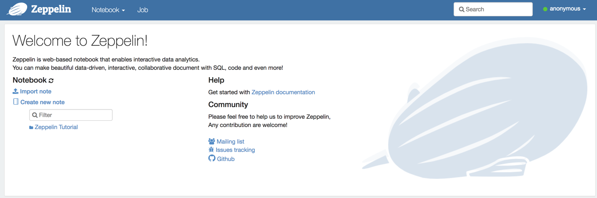

## Connecting to an RDS instance

This guide will setup connections to an AWS RDS instance that can be used inside a Docker-run Zeppelin image.

### Prerequisites

* Install Docker on your operating system. Links and instructions can be found in the [README.md](README.md)

* Create an RDS instance in AWS.

* Update RDS security data to accept all traffic, both Inbound and Outbound.

* Create a table with data inserted. This will allow you to test the connection.

### Instructions

* Run the docker image `docker run -p 8080:8080 --rm --name zeppelin trilogyed/zepl:1.0.0`.

* **Note:** The image will be downloaded the first time it is run, which will take a considerable amount of time. After the image has been downloaded, the container will start up much faster in subsequent runs.

* Navigate to `localhost:8080`.

  

* Click **Profile** on top right right and select **Interpreter**.

  

* Click `+Create`.

* Enter an interpreter name and select **jdbc** from the "Interpreter group".

* Enter the password for the RDS in `default.password`.

* Add the AWS endpoint to `default.url` before the port and the database name after port.

* Enter the username for the RDS instance in `default.user`.

  

* Scroll down and click **Save**.

* Navigate back to the main page and click **Create new note.**

* Enter a name for the note, and then select the name of the interpreter just created as the default interpreter. Click **Create**.

  

* Run a `SELECT * FROM <table name>` from a cell to confirm the connection works.

### Adding a Postgres Drive to ZEPL

* On the interpreters screen, search for **Spark**.

  

* Click **Edit** and scroll down to Dependencies.

* Under "artifact" enter the path `/zeppelin/interpreter/jdbc/postgresql-9.4-1201-jdbc41.jar` then click **Save**.

  

* Spark will now be able to connect to an RDS instance using a JDBC URL.

* Test that the connection works by running the following code, using a table currently available in your RDS:

```python
  %pyspark
  jdbc_url = "jdbc:postgresql://<rds endpoint>:5432/<DB name>"
  config = {"user":"root", "password": "<password>"}
  my_df = spark.read.jdbc(url=jdbc_url, table='<table name>', properties=config)
  my_df.limit(10).show()
```
