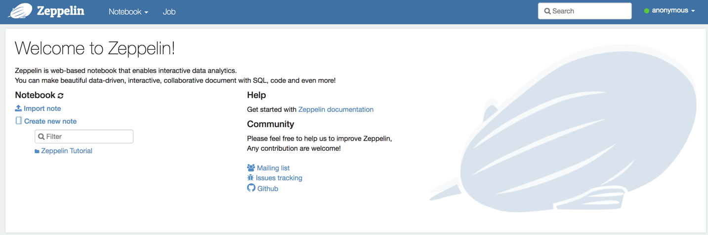

## Zeppelin Guide

The following solution can be used for local testing or if the ZEPL service is down.

## Installing Docker and Zeppelin Image

* Download Docker for your operating system:

  * [Docker for Mac](https://docs.docker.com/docker-for-mac/install/)

  * [Docker for Windows](https://docs.docker.com/docker-for-windows/install/)

* Test that the installation was successful by running the following code in the terminal (Mac) or the Docker shell (Windows):

```shell
docker run hello-world
```

* When you've confirmed the installation was successful, run the following code:

```shell
docker run -p 8080:8080 --rm --name zeppelin trilogyed/zepl:1.0.0
```

* **Note** The Docker image will be downloaded the first time it is run, which will take a considerable amount of time. After the image has been downloaded, the container will start up much faster in subsequent runs.

* Navigate to `localhost:8080` to confirm that Zeppelin is up and running within the Docker container.

  

* **Note:** The container should continue to run within the terminal.

## Troubleshooting

1. Make sure that the Docker container is currently running.

2. Make sure the webpage being used is `localhost:8080`.

3. Consult the [VideoGuide.md](VideoGuide.md).
