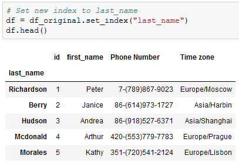
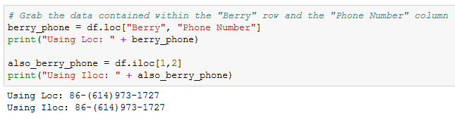
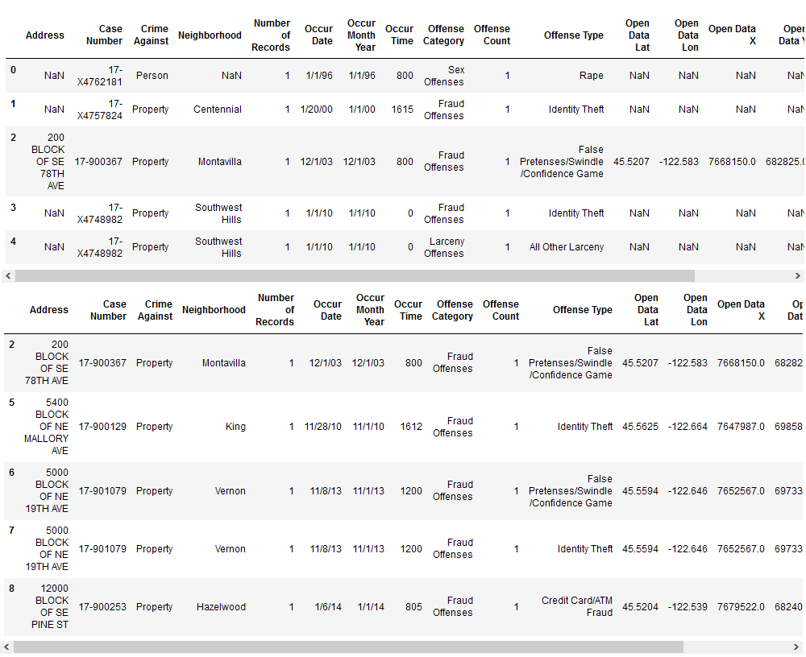

## 4.2 Lesson Plan - Exploring Pandas

### Overview

Today's lesson takes dives deeply into Pandas and covers some of the library's more complex functions - like iloc, loc, and grouping - whilst solidifying the concepts from the last class.

### Sample Class Video (Highly Recommended)

* To view an example class lecture visit (Note video may not reflect latest lesson plan): [Class Video](https://codingbootcamp.hosted.panopto.com/Panopto/Pages/Viewer.aspx?id=524fdd71-4e47-47f3-b2fe-aa780173e041)

- - -

### Class Objectives

* Students will understand how to navigate through DataFrames using Loc and Iloc
* Students will understand how to filter and slice Pandas DataFrames
* Students will understand how to create and access Pandas GroupBy objects
* Students will understand how to sort DataFrames

- - -

### Instructor Notes

* Please reference our [Student FAQ](../../../05-Instructor-Resources/README.md#unit-04-pandas) for answers to questions frequently asked by students of this program. If you have any recommendations for additional questions, feel free to log an issue or a pull request with your desired additions.

### 1. Instructor Do: Welcome Students (0:05)

* Welcome students back from class and explain that we will be diving back into Pandas today. Explain that a lot is being covered and not to get worried, there will be plenty of time to practice with pandas, not only this week, but throughout the course. Today, we will continue to move along learning new functions in Pandas.

### 2. Instructor Do: Exploring Data With Loc and Iloc (0:10)

* One of the most powerful aspects of Pandas is how easily programmers can collect specific rows/columns of data from a DataFrame using the `loc()` and `iloc()` methods.

  * The `loc()` method allows its users to select data using label based indexes. In other words, it takes in strings as the keys and returns data based upon that.

  * Using `loc()` to search through rows is only really useful when the index of a dataset is a collection of strings. It is almost always useful when selecting data from columns, however, since column headers are exclusively strings. This can be done by using the `df.set_index()` function and passing in the desired column header for the index.

  

  * The `iloc()` method also allows its users to select data, but instead of using labels, it instead uses integer based indexing for selection by position. In other words, it selects data in much the same way as one would select data from within a list; using a numeric index.

* Open up [01-Ins_LocAndIloc](Activities/01-Ins_LocAndIloc/Solved/LocAndIloc.ipynb) within Jupyter Notebook and run through the code line-by-line with the class.

  * The typical way in which data is called using both `loc[]` and `iloc[]` is by using a pair of brackets which contain the rows desired, followed by a comma, and then the columns desired. For example: `loc["Berry","Phone Number"]` or `iloc[1,2]`

  

  * It is also possible to select a range of data using `loc[]` and `iloc[]` by placing all of the values within brackets and/or using a colon to tell Pandas to look for a range. For example: `loc[["Richardson", "Berry", "Hudson", "Mcdonald", "Morales"],["id", "first_name", "Phone Number"]]` or `iloc[0:4, 0:3]`

  * By passing in a colon by itself, `loc[]` and `iloc[]` will select all rows or columns depending on where it is placed in relation to the comma. For example: `loc[:, ["first_name", "Phone Number"]` will select all rows of data but will only return the "first_name" and "Phone Number" columns.

  

* Another exciting feature of `loc[]` and `iloc[]` is that these methods can be used to conditionally filter rows of data based upon the values contained within a column.

  * The way in which this is done is by calling `loc[]` or `iloc[]` on a DataFrame and passing a logic test in place of the rows section of the call. For example: `loc[df["id"] >= 10, :]` will return all rows of data with a value equal to or greater than 10 within the "id" column.

  * It is possible to then select which columns to return by simply adding their references into the columns section of the `loc[]` or `iloc[]` expression.

  * If there are multiple conditions that should be checked for, `&` and `|` may also be added into the logic test as representations of `and` and `or`. This allows for a great amount of customization.

  

### 3. Students Do: Good Movies (0:20)

* Now that the class has covered exploring/filtering DataFrames using `loc[]` and `iloc[]`, students will now create an application that looks through IMDB data in order to find only the best movies out there.

* **Files:**

  * [goodMovies_unsolved.ipynb](Activities/02-Stu_GoodMovies/Unsolved/goodMovies.ipynb)

  * [movie_scores.csv](Activities/02-Stu_GoodMovies/Unsolved/Resources/movie_scores.csv)

* **Instructions:**

  * Use Pandas to load and display the CSV provided in `Resources`.

  * List all the columns in the data set.

  * We're only interested in IMDb data, so create a new table that takes the Film and all the columns relating to IMDB.

  * Filter out only the good movies—i.e., any film with an IMDb score greater than or equal to 7 and remove the norm ratings.

  * Find less popular movies that you may not have heard about - i.e., anything with under 20K votes

  * Finally, export this file to a spreadsheet, excluding the index, so we can keep track of our future watchlist.

### 4. Everyone Do: Good Movies Review (0:05)

* Open [02-Stu_GoodMovies](Activities/02-Stu_GoodMovies/Solved/good_movies.ipynb) and walk through the code with the class, answering whatever questions students have.

* Some key tidbits of information to cover during this review:

  * Since the user is only interested in data that pertains to IMDB, all rows that contain review information outside of IMDB are filtered out manually by simply dropping those rows.

  * In order to collect those films with a score greater than or equal to 7, a conditional `loc[]` filter is used that looks into the "IMDB" column and only collects those rows that pass through the logic test with a True value.

  * In order to collect those films that have less than 20K votes, another conditional `loc[]` filter is used that searches through the "IMDB_user_vote_count" column and only collects those rows that pass through the logic test with a True value.

  

### 5. Instructor Do: Cleaning Data (0:05)

* When dealing with massive datasets it is almost inevitable that duplicate rows, inconsistent spelling, and missing values will crop up.

  * While these issues may not seem significant in the grand scheme of things, they can severely hinder the analysis and visualization of a dataset by skewing the data one way or another.

  * Thankfully Pandas includes methods through which its users can remove missing values, replace duplicates, and change values with relative ease.

* Open up [03-Ins_CleaningData](Activities/03-Ins_CleaningData/Solved/CleaningData.ipynb) within Jupyter Notebook and run through the code line-by-line with the class.

  * In order to delete a column of extraneous information from a DataFrame: `del <DataFrame>[<Column>]`

  * In order to figure out if any rows are missing data, simply run the `count()` method on the DataFrame and check that all columns contain equal values.

  * In order to drop rows with missing information from a DataFrame: `<DataFrame>.dropna(how="any")`

  

  * Sometimes the rows containing "NaN" values should not be removed but should instead be filled with another value. In cases like these, simply using the `<DataFrame>.fillna(value=<Value>)` method and pass the value desired into the parentheses.

  * In order to find values that have similar/misspelled values, simply run the `value_counts()` method on the column in question and look through the values that are returned.

  * To replace similar/misspelled values, simply run the `replace()` method on the column in question and pass a dictionary into it with the keys being those values to replace and the value being those to replace the originals with.

  

### 6. Partners Do: Portland Crime (0:20)

* Students will now take a crime dataset from Portland and do their best to clean it up so that the DataFrame is consistent and no rows with missing data are present.

* Open up [04-Par_PortlandCrime](Activities/04-Par_PortlandCrime/Solved/PortlandCrime.ipynb) within the Jupyter Notebook and run the code to show the end results of the application.

* **Files:**

  * [PortlandCrime.ipynb](Activities/04-Par_PortlandCrime/Unsolved/PortlandCrime.ipynb)

  * [crime_incident_data2017.csv](Activities/04-Par_PortlandCrime/Unsolved/Resources/crime_incident_data2017.csv)

* **Instructions:**

  * Read in the csv using Pandas and print out the DataFrame that is returned

  * Get a count of rows within the DataFrame in order to determine if there are any null values

  * Drop the rows which contain null values

  * Search through the "Offense Type" column and replace any similar values with one consistent value

  * Create a couple DataFrames that look into one Neighborhood only and print them to the screen

### 7. Instructor Do: Review Portland Crime (0:05)

* Open [15-Par_PortlandCrime](Activities/04-Par_PortlandCrime/Solved/PortlandCrime.ipynb) within the Jupyter Notebook and go over the solution briefly with students while answering any questions they have.

### 8. Everyone Do: Pandas Recap and Data Types (0:15)

* This activity will serve as a recap for what has been covered in Pandas up to this point.

* Open up and slack out the unsolved version of [05-PandasRecap](Activities/05-Evr_PandasRecap/Unsolved/PandasRecap.ipynb) along with [ufoSightings.csv](Activities/05-Evr_PandasRecap/Unsolved/Resources/ufoSightings.csv).

  * Go through the cells within the unsolved version of the Jupyter Notebook, having the class assist in creating the code that would accomplish the tasks listed within the comments.

  * If there is ever a moment in which your class seems to be struggling, feel free to refer to the solved version of [05-PandasRecap](Activities/05-Evr_PandasRecap/Solved/PandasRecap.ipynb) in order to help keep the class on track.

  * Disregard the "low-memory" warning produced after loading the csv.  It is occurring because Pandas is analyzing the data type of each column.

  * Upon reaching the final cell, let the class know that this DataFrame has a small problem. The majority of the columns - even those that are purely numeric - are being stored as objects.

  * A list of a DataFrame's data types can be seen by accessing its `dtypes` property

    

  * This means that it is currently impossible to perform any form of calculation on the "Duration (Seconds)" column at this time. Luckily Pandas includes a way in which to change a column's data type easily.

* In order to change a non-numeric column to a numeric column, use the `df.astype(<datatype>)` method and pass in the desired datatype as the parameter.

- - -

### 9. BREAK (0:15)

- - -

### 10. Instructor Do: Pandas Grouping (0:10)

* In the last activity, the class created a DataFrame which contained the sum of UFO sightings in each state. This acted as a summary table but does not include other interesting data point. For example: It does not contain the number of seconds UFOs were sighted for within each state.

  * While it would be possible to collect and calculate the sum of seconds for each state through the ample use of `.loc[]` filtering, there is a far simpler method that would cut down on time immensely.

* Open up [06-Ins_GroupBy](Activities/06-Ins_GroupBy/Solved/GroupBy.ipynb) within Jupyter Notebook and run through the code with the class, explaining it cell-by-cell.

  * The start of the code is much the same as earlier. Import in dependencies, remove all rows with missing data, convert the "duration (seconds)" column to numeric, filter the DataFrame so only US info is shown, and count the number of sightings per state.

  * The `df.groupby([<Columns>])` method is then used in order to split the DataFrame into multiple groups with each group being a different state within the US.

  * The object returned by the `.groupby()` method is a GroupBy object and cannot be accessed like a normal DataFrame. In fact, one of the only ways in which to access values within a GroupBy object is by using a data function on it.

    

  * It is possible to create new DataFrames using purely GroupBy data. This can by done by taking the `pd.DataFrame()` method and passing the GroupBy data desired in as the parameter.

  * A DataFrame can also be created by selecting a single series from a GroupBy object and passing it in as the values for a specified column.

    

  * It is possible to perform a `df.groupby()` method on multiple columns as well. This can be done by simply passing two or more column references into the list parameter.

    

  * A new dataframe can be created from a GroupBy object.

    

### 11. Partners Do: Building a PokeDex (0:25)

* Students will now take some time to create a DataFrame that visualizes the average stats for each type of Pokemon from the popular video game series. They will do so using the `GroupBy()` method and then converting their findings into a DataFrame.

* Open up the solved version of [07-Par_Pokemon](Activities/07-Par_Pokemon/Solved/pokemon.ipynb) within Jupyter Notebook in order to show students what the final version of their application should look like.

  

* **Files:**

  * [Pokemon.csv](Activities/07-Par_Pokemon/Unsolved/Resources/Pokemon.csv)

  * [pokemon.ipynb](Activities/07-Par_Pokemon/Unsolved/pokemon.ipynb)

* **Instructions:**

  * Read the Pokemon CSV file with Pandas.

  * Create a new table by extracting the following columns: "Type 1", "HP", "Attack", "Sp. Atk", "Sp. Def", and "Speed".

  * Find the average stats for each type of Pokemon.

  * Create a new DataFrame out of the averages.

  * Calculate the total power level of each type of Pokemon by summing all of the previous stats together and place the results into a new column.

* **Bonus:**

  * Sort the table by strongest type and export the resulting table to a new CSV

### 12. Everyone Do: Building a PokeDex Review (0:10)

* Open up the solved version of [07-Par_Pokemon](Activities/07-Par_Pokemon/Solved/pokemon.ipynb) within Jupyter Notebook and work through the code with the class, making certain to cover the following points...

  * The original dataset is read into a Pandas DataFrame and is then cut down so that only the "Type 1" and stat columns remain.

  * The DataFrame is then grouped according to the values contained within the "Type 1" column and the averages for each type are then calculated using the `df.mean()` method.

    

  * A new DataFrame is then created using the GroupBy object returned by `pokemon_group.mean()` and the totals for each type of Pokemon is calculated by adding up the values in each row before placing them into a newly created "Totals" column.

    

* Answer whatever questions the class may have before moving onto the next activity.

### 13. Instructor Do: Sorting Made Easy (0:10)

* Within the last activity's bonus, students were asked to sort their final table by which type of Pokemon was strongest. While the solution to this problem could be uncovered rather simply through some applied "Google-Fu", there are some quirks to sorting which should be covered.

* Open up [08-Ins_Sorting](Activities/08-Ins_Sorting/Solved/Sorting.ipynb) within Jupyter Notebook and run through the code with the class, discussing it cell-by-cell.

  * The data being used here is the 2017 world happiness rankings and, while they have already been sorted from most happy to least happy, it is possible to sort this dataset using the values in different columns.

  * In order to sort a DataFrame based upon the values within a column, simply use the `df.sort_values()` method and pass the column name to sort by in as a parameter.

  * The parameter of "ascending" is always marked as True by default. This means that the `sort_vales()` method will always sort from lowest to highest unless the parameter of `ascending=False` into passed into the `sort_values()` method as well.

    

  * Something immensely helpful when dealing with sorted DataFrames is the `df.reset_index()` method. This method will recalculate the index for each row based upon their position within the new DataFrame and, as such, will allow for far simpler referencing of rows in the future.

  * Passing `drop=True` into `df.reset_index()` will ensure no new column is created when the index is reset.

  * It is possible to sort based upon the values stored within multiple columns by passing a list of columns into the `sort_values()` method as a parameter. The first column will be the primary sorting method with ties being broken by the second column.

### 14. Students Do: Search For the Worst (0:20)

* Students will now take a dataset composed of soccer player statistics and will attempt to determine which players are the worst in the world at their particular position.

* Open up the solved version of [09-Stu_SearchForTheWorst](Activities/09-Stu_SearchForTheWorst/Solved/SearchForTheWorst.ipynb) within Jupyter Notebook in order to show students what the final version of their application should look like.

  

* **Files:**

  * [SearchForTheWorst.ipynb](Activities/09-Stu_SearchForTheWorst//Unsolved/SearchForTheWorst.ipynb)

  * [Soccer2018Data.csv](Activities/09-Stu_SearchForTheWorst//Unsolved/Resources/Soccer2018Data.csv)

* **Instructions:**

  * Read in the CSV file provided and print it to the screen.

  * Print out a list of all of the values within the "Preferred Position" column.

  * Select a value from this list and create a new DataFrame that only includes players who prefer that position.

  * Sort the DataFrame based upon a player's skill in that position.

  * Reset the index for the DataFrame so that the index is in order.

  * Print out the statistics for the worst player in a position to the screen.

### 15. Everyone Do: Search For the Worst Review (0:05)

* Open up [09-Stu_SearchForTheWorst](Activities/09-Stu_SearchForTheWorst/Solved/SearchForTheWorst.ipynb) within Jupyter Notebook and run through the code with the class, discussing it cell-by-cell.

  * To collect a list of all the positions players prefer to play in, the `unique()` method is run on the "Preferred Position" column within the DataFrame.

  * To filter in only those players that play in a particular position, use `df.loc()` and have it collect only those rows where "Preferred Position" is equal to the position desired.

  * To sort the values within the new DataFrame from lowest to highest, simply run the `df.sort_values()` method, pass the position column to sort by, and then make sure that `ascending = True`. This final step should be completed by default without having to be entered.

    

- - -

### LessonPlan & Slideshow Instructor Feedback

* Please click the link which best represents your overall feeling regarding today's class. It will link you to a form which allows you to submit additional (optional) feedback.

* [:heart_eyes: Great](https://www.surveygizmo.com/s3/4381674/DataViz-Instructor-Feedback?section=pandas-day-2&lp_useful=great)

* [:grinning: Like](https://www.surveygizmo.com/s3/4381674/DataViz-Instructor-Feedback?section=pandas-day-2&lp_useful=like)

* [:neutral_face: Neutral](https://www.surveygizmo.com/s3/4381674/DataViz-Instructor-Feedback?section=pandas-day-2&lp_useful=neutral)

* [:confounded: Dislike](https://www.surveygizmo.com/s3/4381674/DataViz-Instructor-Feedback?section=pandas-day-2&lp_useful=dislike)

* [:triumph: Not Great](https://www.surveygizmo.com/s3/4381674/DataViz-Instructor-Feedback?section=pandas-day-2&lp_useful=not%great)

- - -

### Copyright

Trilogy Education Services © 2019. All Rights Reserved.
