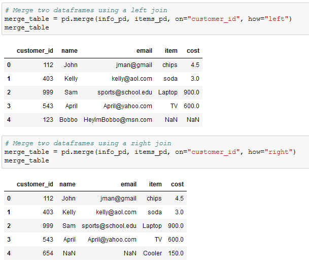
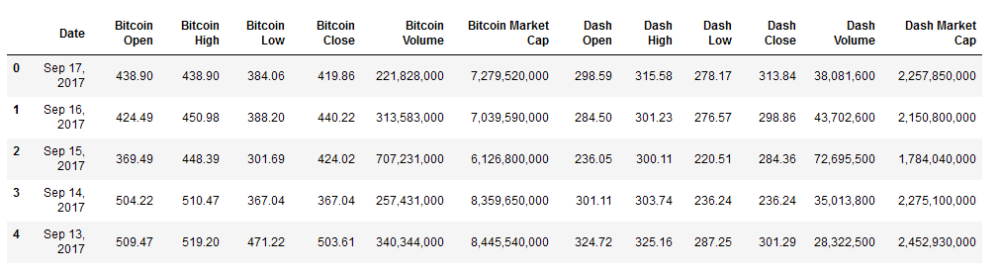
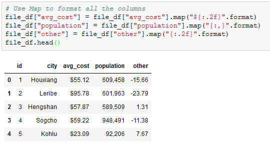

## 4.3 Lesson Plan - Merging and Data Clean Project

### Overview

Today's lesson is split into two parts. The first part will test the class' Pandas skills by having them look through buggy code and fixing the problems so it functions properly. The second part will require students to use all the tools they have learned this week to fully understand the concept of data engineering.

### Instructor Notes

* You may find that this lesson falls on a weekday due to a holiday shifting the course schedule. In this case, we have provided notes within the LP that will allow you to **easily adjust the length of the lesson to fit into a weekday class**.

  * Be on the lookout for a **3-Hour Adjustment** note at the top of activities in this Lesson Plan. If this class is being taught on a weekday, please utilize the directions found in the note. Keep in mind that breaks will be reduced from 40 minutes to the typical 15 minutes for a weekday class as well.

  * Shortening these activities could potentially limit the students' ability to finish them, so please remind them to utilize office hours to clear up any questions they may have.

* There is very little in the way of lecture this class. In fact, most of the day will be taken up with large-scale activities that will test the skill and problem-solving ability of the class. As such, make certain that everyone on the instructional team is up to assisting students whenever a bug or question arises.

* There are bound to be times in which a question or block of code will baffle even the most senior of Pandas programmer. It is for this reason that it may be wise to carry a laptop with the solved code for an activity loaded up already. This way, whenever a student gets stuck, there is an easy reference on hand to help fix the problem.

* Please reference our [Student FAQ](../../../05-Instructor-Resources/README.md#unit-04-pandas) for answers to questions frequently asked by students of this program. If you have any recommendations for additional questions, feel free to log an issue or a pull request with your desired additions.

### Sample Class Video (Highly Recommended)

* To view an example class lecture visit (Note video may not reflect latest lesson plan): [Class Video](https://codingbootcamp.hosted.panopto.com/Panopto/Pages/Viewer.aspx?id=b5186a86-2ef2-489b-87f5-aa7b00e1cf28)

- - -

### Class Objectives

* Students will know how to merge DataFrames together whilst understanding the differences between inner, outer, left, and right merges.
* Students will be able to slice data using the `cut()` method and create new values based upon a series of bins.
* Students will feel more confident in their ability to fix Python/Pandas bugs within Jupyter Notebook.
* Students will be able to use Google to explore additional Pandas functionality when necessary.

- - -

### 1. Instructor Do: Welcome Class (0:05)

* Welcome the class to class and let them know that today will dive into a few more functions in the pandas library and learning how to deal with multiple datasets.The end of the lesson will focus far more intently on teaching everyone how to teach themselves and bug fixing.

  * While this concept may sound a bit strange to the class at first, let them know that self-teaching is probably the most important skill in the programming arsenal since languages are never set in stone.

  * New libraries are always being developed and even core programming languages are always being updated to include new functions or syntax. As such, the master programmer must always be ready and willing to teach themselves new skills.

  * If students seem nervous, reassure them that self-teaching becomes much easier as time goes by. Students may have already found themselves practicing this skill without even realizing it since the best way in which to learn new techniques is to make mistakes and look up solutions online.

### 2. Instructor Do: Merging DataFrames (0:10)

* Sometimes, the data an analyst is provided with is split into multiple parts. This, of course, is not an ideal situation as it is far more preferable to work with a single dataset than it is to work with a bunch of different datasets.

  * This is where the concept of merging comes into play, as Pandas allows its users to quite easily combine separate DataFrames on similar values using the `pd.merge()` method.

* Open up [01-Ins_Merging](Activities/01-Ins_Merging/Solved/Merging.ipynb) within Jupyter Notebook and run through the code with the class, discussing it cell-by-cell.

  * The first chunks of code are used to create two DataFrames which contain information on customers and the purchases they have made.

  * Make sure to point out how these two DataFrames share the "customer_id" column in common. This will be very important soon.

  * In the final chunk of code, the `pd.merge()` method is used and three parameters are passed into it: references to both of the DataFrames and the value `on="customer_id"`.

  * This code tells the computer to combine the two DataFrames together so that, whenever the "customer_id" column matches, the rows containing the matching data are joined.

    

  * This is what is known as an inner join. Inner joins are the default means through which DataFrames are combined using the `pd.merge()` method and will only return data whose values match. Any rows that do not include matching data will be dropped from the combined DataFrame.

  * The opposite of an inner join is an outer join. Outer joins will combine the DataFrames regardless of whether any of the rows match and must be declared as a parameter within the `pd.merge()` method using the syntax `how="outer"`.

    

  * Any rows that do not include matching data will have the values within replaced with `NaN` instead.

  * There are also right and left joins. These joins will protect the data contained within one DataFrame like an outer join does whilst also dropping the rows with null data from the other DataFrame.

    

### 3. Students Do: Cryptocurrency Merging (0:20)

* **3-Hour Adjustment**: Reduce activity time to 15 minutes.

* Students will now take some time to merge together two datasets on cryptocurrencies, one on Bitcoin and the other on Dash. They will then clean up the combined DataFrame to make it more presentable.

* Open up the solved version of [02-Stu_Cryptocurrency](Activities/02-Stu_Cryptocurrency/Solved/Cryptocurrency.ipynb) within Jupyter Notebook in order to show students what the final version of their application should look like.

  

* **Files:**

  * [Cryptocurrency.ipynb](Activities/02-Stu_Cryptocurrency/Unsolved/Cryptocurrency.ipynb)

  * [bitcoin_cash_price.csv](Activities/02-Stu_Cryptocurrency/Unsolved/Resources/bitcoin_cash_price.csv)

  * [dash_price.csv](Activities/02-Stu_Cryptocurrency/Unsolved/Resources/dash_price.csv)

* **Instructions:**

  * Read in both of the CSV files and print out their DataFrames.

  * Perform an inner merge that combines both DataFrames on the "Date" column.

  * Rename the columns within the newly merged DataFrame so that the headers are more descriptive.

  * Create a summary table that includes the following information: `Best Bitcoin Open`, `Best Dash Open`, `Best Bitcoin Close`, `Best Dash Close`, `Total Bitcoin Volume`, `Total Dash Volume`.

  * `Total Bitcoin Volume` and `Total Dash Volume` should be calculated to have units of "millions" and be rounded to two decimal places.

### 4. Everyone Do: Cryptocurrency Merging Review (0:10)

* Open up [02-Stu_Cryptocurrency](Activities/02-Stu_Cryptocurrency/Solved/Cryptocurrency.ipynb) within Jupyter Notebook and run through the code with the class, discussing it cell-by-cell.

  * Once the two DataFrames have been merged, the column headers are messed up. This is because the columns within the first DataFrame match those within the second and Pandas feels the need to differentiate them somehow. This also means the columns need to be renamed manually.

    

  * Alternatively, you can create custom suffixes by adding a `suffixes = (_x,_y)` argument to `pd.merge`.  `_x` and `_y` can be replaced with any text you wish.

    

  * To find the total volumes for Bitcoin and Dash, our code divides the sum of their columns by one million and then rounds the returned value to the nearest two decimal places.

  * The values for our summary DataFrame are held within brackets because, without them, Pandas would have difficulties understanding that all of these values should be held within the same row.

    

### 5. Instructor Do: Binning Data (0:10)

* Not everyone is a numbers person and sometimes there are so many values within a DataFrame that it becomes very difficult to comprehend what exactly is going on. For this reason, Pandas has a built-in "binning" method that allows its users to place values into groups so as to allow for more vigorous customization of datasets.

* Open up [03-Ins_Binning](Activities/03-Ins_Binning/Solved/Binning.ipynb) within Jupyter Notebook and run through the code with the class, discussing it cell-by-cell.

  * When using the `pd.cut()` method, three parameters must be passed in. The first is the Series that is going to be cut. The second is a list of the bins that the Series will be sliced into. The last is a list of the names/values that will be given to the bins.

  * It is important to note how, when creating the list for bins, Pandas will automatically determine the range between values. This means that, when given the list `[0, 59, 69, 79, 89, 100]`, Pandas will create bins with ranges between those values in the list.

  * The labels for the `pd.cut()` method must have an equal length to the number of bins. If there are too many or too few, an error will be returned.

    

  * What makes binning so powerful is that, after creating and applying these bins, the DataFrame can be grouped according to those values and thus a higher-level analysis can be conducted.

    

### 6. Students Do: Binning TED (0:25)

* The class will now put their binning skills to the test by creating bins for TED Talks based upon their viewership. After creating the bins, they will then group the DataFrame based upon those bins and perform some analysis on them.

* Open up the solved version of [04-Stu_TedTalks](Activities/04-Stu_TedTalks/Solved/BinningTed.ipynb) within Jupyter Notebook in order to show students what the final version of their application should look like.

  

* **Files:**

  * [BinningTed.ipynb](Activities/04-Stu_TedTalks/Unsolved/BinningTed.ipynb)

  * [ted_talks.csv](Activities/04-Stu_TedTalks/Unsolved/Resources/ted_talks.csv)

* **Instructions:**

  * Read in the CSV file provided and print it to the screen.

  * Find the minimum "views" and maximum "views".

  * Using the minimum and maximum "views" as a reference, create 10 bins in which to slice the data.

  * Create a new column called "View Group" and fill it with the values collected through your slicing.

  * Group the DataFrame based upon the values within "View Group".

  * Find out how many rows fall into each group before finding the averages for "comments", "duration", and "languages".

### 7. Everyone Do: Binning TED Review (0:05)

* Open up [04-Stu_TedTalks](Activities/04-Stu_TedTalks/Solved/BinningTed.ipynb) within Jupyter Notebook and run through the code with the class, discussing it cell-by-cell.

  * Since the values contained within the "views" column are so widespread, there are several ways in which to split up the data that would be acceptable. This particular code uses a variable scale that attempts to look at every 200k view difference until reaching the millions, at which point it switches to look at every 1mil difference.

    

  * The bins are added into the DataFrame by simply placing them within a new column. The DataFrame is then grouped on this new column in order to perform all of the Data Functions.

### 8. Instructor Do: Mapping (0:10)

* Students may recall how Excel's number formats allows its users to change the styling of columns without much effort. Pandas also includes this functionality through its `df.map()` method, thus allowing users to style columns wholesale.

* Open up [05-Ins_Mapping](Activities/05-Ins_Mapping/Solved/Mapping.ipynb) within Jupyter Notebook and run through the code with the class, discussing it cell-by-cell.

  * `df[<COLUMN>].map(<FORMAT STRING>.format)` is the method by which users can modify the styling of an entire column.

  * The formatting syntax used for mapping is, in a word, confusing. It uses strings containing curly brackets in order to determine how to style columns and this can make it rather difficult to understand at first glance.

  * A somewhat easy way to understand mapping strings is that it is almost akin to concatenating strings. Whatever is outside of the curly brackets is added before/after the initial value which is modified by whatever is contained within the curly brackets.

  * So, to convert values into a typical dollar format, one would use `"${:.2f}"`. This places a dollar sign before the value which has been rounded to two decimal points.

  * Using `"{:,}"` will split a number up so that it uses comma notation. For example: the value `2000` would become `2,000` using this format string.

    

  * Format mapping only really works once and will return errors if the same code is run multiple times without restarting the kernel. Because of this, formatting is usually applied near the end of an application.

  * Format mapping also can change the datatype of a column. As such, all calculations should be handled before modifying the formatting.

    

### 9. Partners Do: Cleaning Kickstarter (0:30)

* **3-Hour Adjustment**: Skip this **Partners Do** activity and continue on to the review activity.

* The class will now spend the remainder of the lesson flexing their Pandas muscles by taking a dataset similar to that of their first homework, cleaning it up, and formatting it in far less time than it would take in Excel.

* Open up the solved version of [06-Stu_CleaningKickstarter](Activities/06-Stu_CleaningKickstarter/Solved/KickstarterClean.ipynb) within Jupyter Notebook in order to show students what the final version of their application should look like.

* **Files:**

  * [KickstarterData.csv](Activities/06-Stu_CleaningKickstarter/Unsolved/Resources/KickstarterData.csv)

  * [KickstarterClean.ipynb](Activities/06-Stu_CleaningKickstarter/Unsolved/KickstarterClean.ipynb)

* **Instructions:**

  * The instructions for this activity are contained within the Jupyter Notebook.

### 10. Everyone Do: Cleaning Kickstarter Review (0:10)

* **3-Hour Adjustment**: This review activity is now an **Everyone Do**.

  * Spend only 30 minutes on this activity.

  * Use the review section as guidance for talking points as you live-code along with the students.

  * Be sure to take your time and answer all student questions along the way.

* Open up [06-Stu_CleaningKickstarter](Activities/06-Stu_CleaningKickstarter/Solved/KickstarterClean.ipynb) within Jupyter Notebook and run through the code with the class, discussing it cell-by-cell.

- - -

### 11. BREAK (0:40)

* **3-Hour Adjustment**: Reduce break time to 15 minutes.

- - -

### 12. Instructor Do: Intro to Bugfixing (0:15)

* Open up [07-Ins_IntroToBugfixing](Activities/07-Ins_IntroToBugfixing/Unsolved/IntroToBugfixing_Unsolved.ipynb) within Jupyter Notebook and slack the code out to the class as well. Make certain to send [flavors_of_cacao.csv](Activities/07-Ins_IntroToBugfixing//Unsolved/Resources/flavors_of_cacao.csv) out to the class as well.

  * Point out to the class how, within the third block of code, an error is being returned as the application attempts to collect the average value within the "Cocoa Percent" column.

    

  * Many within the class likely already know what the bug within this block of code is - the values within the column are strings and it is not possible to collect the mean of a string - but tell them to hold off on pointing this out for now.

* The first step in fixing a bug is to keep calm.

  * Bugs happen all the time and they are rarely the end of the world. In fact, most bugs that programmers run across are simple enough to solve so long as they know how and where to look for the solution.

* The second step to bugfixing an application is to figure out what the bug is and where it is located.

  * Since the class is using Jupyter Notebook at this point in time, it is quite easy to find the erroneous block of code since the error will always be returned in the space beneath the erroneous cell.

  * Unfortunately Pandas is not known for returning clearly understandable error text. In fact, it often returns large blocks of text that is complex and confusing to those who do not know the library's underlying code. Looking for the line following `KeyError:` is generally a good starting point.

  * For example, the text following `TypeError:` within the current code lets the programmer know that Pandas cannot convert the string values in the "Cocoa Percent" column to floats.

    

  * If the error text is not entirely clear, it is oftentimes helpful to print out variables/columns to the console in order to uncover where the bug is. For example, printing out the "Cocoa Percent" series lets the programmer know that the `dtype` of this series is an object and not a float.

* The third step is to look up the error online and search for solutions that other programmers have uncovered.

  * The key part to this step is coming up with an accurate way to describe the bug. This may take multiple tries and is a skill that will develop over time.

  * Google is the programmer's best friend as typing in a description of the bug being faced will often bring up links to some possible solutions. If not, simply change the search up a little bit until a solution is discovered.

    

  * This particular problem requires the code to drop the percentages within the "Cocoa Percent" column, so the search should be a bit more specific.

    

  * The first link takes the class to a StackOverflow question which asks how to drop percentages and convert a column to floats. This provides an answer to the bug.

  * Feel free to copy and paste the solution and then modify it within Jupyter Notebook. Let the class know that copying and pasting from StackOverflow is something almost every single programmer does.

    

### 13. Students Do: Bugfixing Bonanza! (0:34)

* **3-Hour Adjustment**: Skip this **Students Do** activity and continue on to the review activity.

* The class will now be provided with a Pandas project containing TONS of bugs inside of it. Their job will be to take the application and fix it up so that it works properly. This will both put their Pandas skills to the test while also teaching them how to teach themselves.

* Open up the solved version of [08-Stu_BugfixingBonanza](Activities/08-Stu_BugfixingBonanza/Solved/BugfixBonanza.ipynb) within Jupyter Notebook in order to show students what the final version of their application should look like.

* **Files:**

  * [BugfixBonanza.ipynb](Activities/08-Stu_BugfixingBonanza/Unsolved/BugfixBonanza.ipynb)

  * [EclipseBugs.csv](Activities/08-Stu_BugfixingBonanza/Unsolved/Resources/EclipseBugs.csv)

* **Instructions:**

  * Dig through the Jupyter Notebook provided and attempt to fix as many bugs as possible. There are a lot of them and the bugs get harder to deal with as the code progresses.

  * Once you have finished bugfixing, perform some additional analysis on the dataset provided. See what interesting trends are buried deep within these bug logs for the Eclipse IDE. So long as you challenge yourself, bugs will pop up and you will get even more bugfixing practice.

* **Hints:**

  * After fixing the bugs in each block of code, be sure to run the cell below for an updated error.

  * There are a few new concepts being covered within this Jupyter Notebook. The most complex of these concepts is that of multi-indexing and it is very likely that this is where many will get held up. Do not worry though, multi-indexing is not in the homework and is not required outside of this activity. It is simply an interesting/powerful feature of Pandas.

### 14. Everyone Do: Bugfixing Bonanza Review (0:14)

* **3-Hour Adjustment**: This review activity is now an **Everyone Do**.

  * Spend only 28 minutes on this activity.

  * Use the review section as guidance for talking points as you live-code along with the students.

  * Be sure to take your time and answer all student questions along the way.

* Open up [08-Stu_BugfixingBonanza](Activities/08-Stu_BugfixingBonanza/Solved/BugfixBonanza.ipynb) within Jupyter Notebook and run through the code with the class, discussing it cell-by-cell.

  * Whoever wrote this code originally is not very good at their job... But it is a sad fact of life that many programmers out there are not exceptionally good at crafting clean code. As such, it is extremely helpful to practice bugfixing as much as possible.

  * The first bug is rather simple. No dependencies have been declared and, as such, the application will not be able to use Pandas.

  * The second bug is also pretty simple. The CSV is being read in but it is not being saved to a DataFrame.

  * The third bug is where things start getting complex. For whatever reason, Pandas does not seem to be able to collect data from the "Number of Comments" column. This is because the column header includes new lines inside of it. The columns will need to be renamed to fix this.

    

  * The fourth/fifth bugs are another step up in difficulty as the `assignee_group` DataFrame has two indexes. The first is the "Assignee" and the second is the "Component". While this makes for a nicely organized DataFrame, it creates problems later on.

  * In order to collect the correct values for `total_bugs`, the application must count the "Assignee" column of the initial DataFrame while `bugs_per_user` should count the "Assignee" column of the GroupBy object. The series should then be converted into a DataFrame for merging later on.

  * It is not possible to merge DataFrames on indexes. As such, both of the DataFrames need to have their indexes reset so that it is possible to merge on the "Assignee" column. If this is not done, incorrect data will be used, an error will be returned, or only some rows will be filled.

    

### 15. Instructor Do: Video Guide and Close Class (0:02)

* Before finishing up for the night, slack out the [Video Guide](../VideoGuide.md) containing walkthroughs of this week's key activities. Encourage students to review them later and utilize office hours if they have further questions.

- - -

### LessonPlan & Slideshow Instructor Feedback

* Please click the link which best represents your overall feeling regarding today's class. It will link you to a form which allows you to submit additional (optional) feedback.

* [:heart_eyes: Great](https://www.surveygizmo.com/s3/4381674/DataViz-Instructor-Feedback?section=pandas-day-3&lp_useful=great)

* [:grinning: Like](https://www.surveygizmo.com/s3/4381674/DataViz-Instructor-Feedback?section=pandas-day-3&lp_useful=like)

* [:neutral_face: Neutral](https://www.surveygizmo.com/s3/4381674/DataViz-Instructor-Feedback?section=pandas-day-3&lp_useful=neutral)

* [:confounded: Dislike](https://www.surveygizmo.com/s3/4381674/DataViz-Instructor-Feedback?section=pandas-day-3&lp_useful=dislike)

* [:triumph: Not Great](https://www.surveygizmo.com/s3/4381674/DataViz-Instructor-Feedback?section=pandas-day-3&lp_useful=not%great)

- - -

### Copyright

Trilogy Education Services © 2019. All Rights Reserved.
