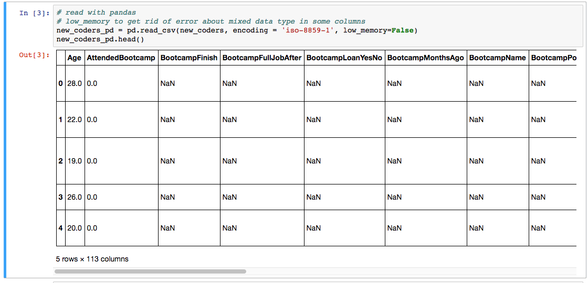
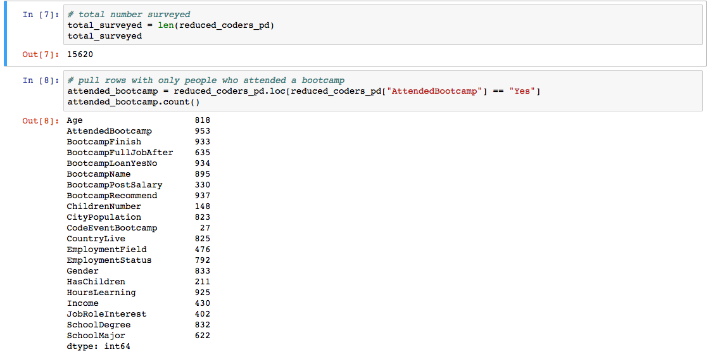
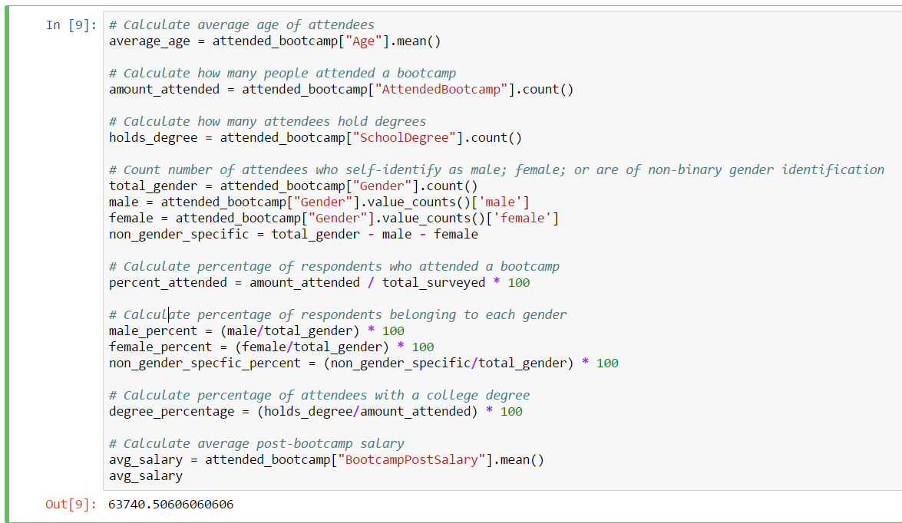
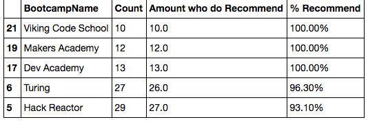
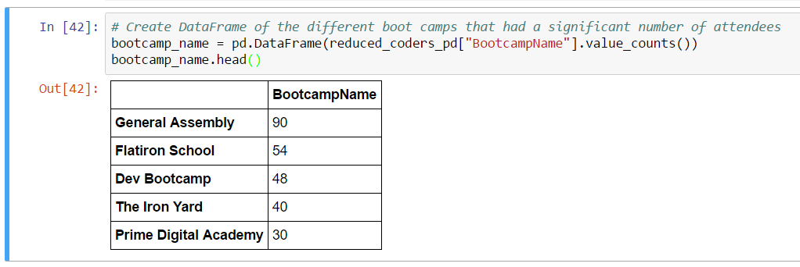
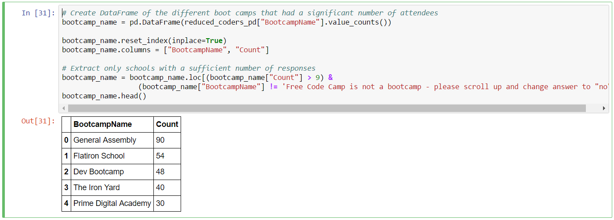
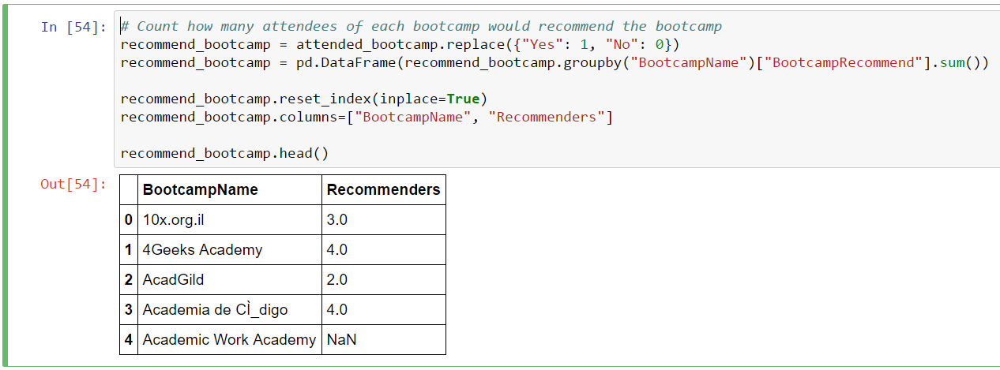
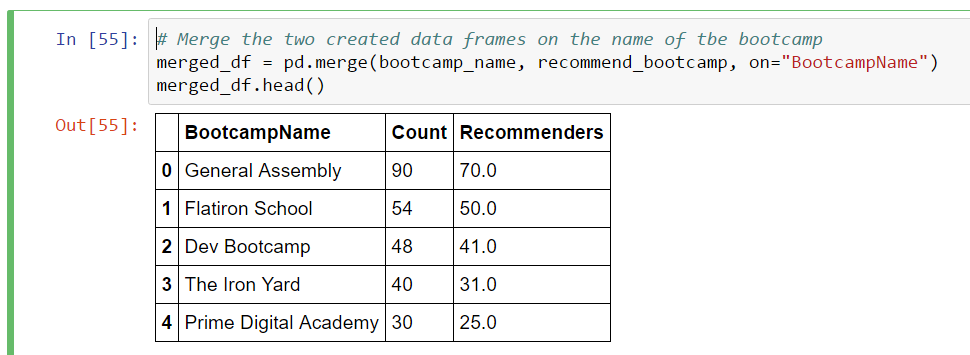
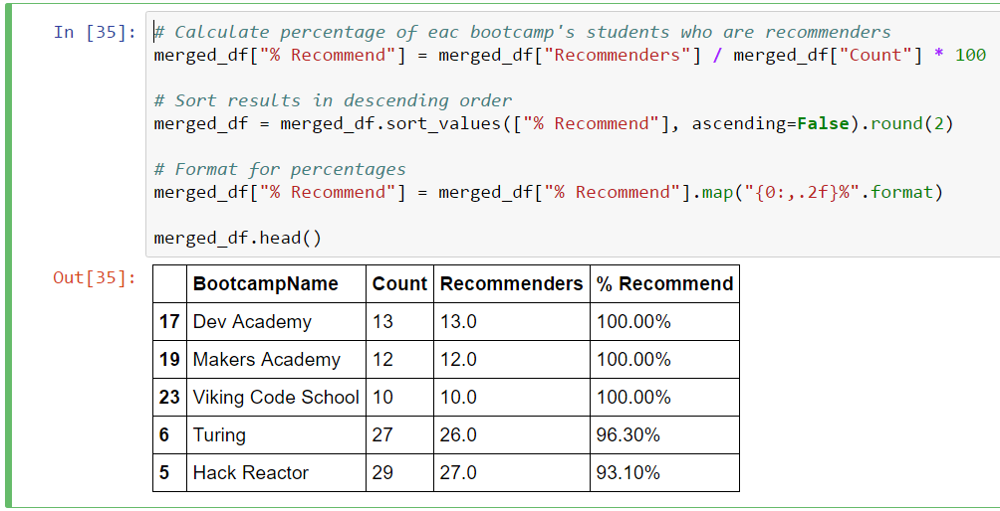

### 5. Students Do: Data Clean-Up I (0:45)

* Explain that data is inherently dirty. It often contains more information than is needed, columns are often mislabeled, and values are often missing or in the wrong format. This activity will require students to use most of what they've learned this week to fix just such a problem in a real-world data set.

* Open up the solved version of [03-Stu_Project_Part_1](Activities/03-Stu_Project_Part_1/Solved/project_part_one_solved.ipynb) within Jupyter Notebook in order to show students what the final version of their application should look like.

* **File:**

  * [2016-FCC-New-Coders-Survey-Data.csv](Activities/03-Stu_Project_Part_1/Unsolved/Resources/2016-FCC-New-Coders-Survey-Data.csv)

  * [project-part-one.ipynb](Activities/03-Stu_Project_Part_1/Unsolved/project_part_one_unsolved.ipynb)

* **Instructions:**

  * The goal for this assignment is to recreate [BootcampOutputPart1.xlsx](Activities/03-Stu_Project_Part_1/Solved/output/BootcampOutputPart1.xlsx).

  * Using Pandas, load the [CSV provided in Resources](Activities/03-Stu_Project_Part_1/Unsolved/Resources/2016-FCC-New-Coders-Survey-Data.csv).

  * Create a new table using the following columns: `[0, 1, 2, 3, 4, 7, 8, 9, 10, 11, 29, 30, 32, 36, 37, 45, 48, 56, 110, 111]`.

  * The data set currently uses 0.0 to represent "No" or "False", and "1.0" to represent "Yes"/"True"—an entry of 0.0 for row 2 in the **Attended Bootcamp** column, for instance, indicates that the respondent with ID 2 did not attend a bootcamp. Replace all instances of "0.0" with No, and all instances of "1.0" with "Yes".

  * Calculate the total number of respondents in the sub-table you built.

  * Create a table out of the rows corresponding only to people who _did_ attend a bootcamp.

  * Calculate the number of people who attended a bootcamp.

  * Calculate the average age of bootcamp attendees.

  * Calculate the number of bootcamp attendees who self-identify as male; female; or neither.

  * Calculate the number of bootcamp attendees who hold college degrees.

  * Calculate the percentage of respondents who attended a bootcamp.

  * Calculate the percentage of people who attended a bootcamp and hold a college degree.

  * Calculate the average post-bootcamp salary.

  * Create a new, two-row table collecting the above data.

  * Use the `format` method to prettify your table—i.e., use `format` to display percents as percents; display numbers to a reasonable number of decimal points; etc.

  * Finally, export the final table into an Excel file.

- - -

### 6. BREAK (0:40)

- - -

### 7. Instructor Do: Review Data Clean-Up I (0:15)

* Open up [03-Stu_Project_Part_1](Activities/03-Stu_Project_Part_1/Solved/project_part_one_solved.ipynb) within Jupyter Notebook and run through the code with the class, discussing it cell-by-cell.

  * Ask a student to explain how they read the CSV. `read_csv` is used and the `low_memory` parameter is set to False so no annoying warnings pop up.

    

  * Point out that this dataset contains far more columns than are necessary for the purposes of this application and ask a student to explain how to extract specific columns from a DataFrame by _position_. The `iloc` method can be used to select columns by position.

    

  * Point out that the data set uses "0.0" to represent "No", and "1.0" to represent "Yes" within columns like "Attended Bootcamp". It would be better if the data used "No" and "Yes" explicitly, instead of "0.0" and "1.0". The `replace` method can be utilized to accomplish this.

    

  * The length of the DataFrame can be used to determine the number of respondents.

  * Ask a student to explain how they would select only people who attended a bootcamp. The `loc` method and a boolean test can be used to extract only the rows corresponding to people who attended a bootcamp.

    

  * Now that the data has been whittled down, it is finally time to start calculating the values that the are really interesting.

  * Ask different students to explain each calculation within the image below and explain each instance of `mean`, `count`, and other such data functions.

    

  * Using the data calculated, a new summary table containing only the information gathered is created.

    

  * Finally, explain how the `format` method is used to "prettify" the table before exporting it to an Excel file.

    

  * Point out that this was a difficult exercise and take a moment to congratulate students on their hard work grinding through a very real-world project.

* Answer any remaining student questions before slacking out the solution and moving on.

### 8. Students Do: Data Clean-Up, Pt. 2 (1:00)

* Explain that the next activity will require students to clean and explore the same dataset in order to generate a very different set of summary data.

* Open up the solved version of [04-Stu_Project_Part_2](Activities/04-Stu_Project_Part_2/Solved/project_part_two_solved.ipynb) within Jupyter Notebook in order to show students what the final version of their application should look like.

  

* **File:**

  * [2016-FCC-New-Coders-Survey-Data.csv](Activities/04-Stu_Project_Part_2/Unsolved/Resources/2016-FCC-New-Coders-Survey-Data.csv)

  * [04-Stu_Project_Part_2](Activities/04-Stu_Project_Part_2/Unsolved/project_part_two_unsolved.ipynb)

* **Instructions:**

  * Create a new table using the following columns: `[0, 1, 2, 3, 4, 6, 7, 8, 9, 10, 11, 29, 30, 32, 36, 37, 45, 48, 56, 110, 111]`.

  * The dataset currently uses 0.0 to represent "No" or "False", and "1.0" to represent "Yes"/"True". Replace all instances of "0.0" with No, and all instances of "1.0" with "Yes".

  * Extract rows corresponding only to respondents who attended a bootcamp.

  * Create a DataFrame with two columns: One with the bootcamp name, and one with the number of respondents who went to each bootcamp.

  * Create another DataFrame with two columns: One for the bootcamp name, and one for the number of respondents who recommend it.

  * Create a new DataFrame by merging the previous two DataFrames on the appropriate column.

  * In your new DataFrame, create a new column containing the percentage of respondents for each bootcamp who would recommend that bootcamp.

  * Sort the new DataFrame in descending order of the percentage of recommenders you just calculated.

  * Use `map` and `format` to make the `"% Recommended"` column look more presentable.

  * Finally, export your DataFrame to an Excel file.

### 9. Instructors Do: Review Activity (0:10)

* Open up [04-Stu_Project_Part_2](Activities/04-Stu_Project_Part_2/Solved/project_part_two_solved.ipynb) within Jupyter Notebook and run through the code with the class, discussing it cell-by-cell.

  * Point out that the first few steps — loading the data by extracting only rows for those who attended a bootcamp — are identical to the previous activity.

  * Remind students that the instructions required them to create a DataFrame selecting only the bootcamps that had a large number of attendees.

  * Ask a student to explain how to accomplish this. Explain that `value_counts` can be used to determine how many people attended each bootcamp and extract only those bootcamps with more than 9 attendees.

  * Ask a student to explain why it is necessary to use `reset_index`. Explain that the `bootcamp_name` DataFrame won't have an index _at all_ if this method is not used! Without an index it is not possible to filter or merge the DataFrame.

    
    

  * Explain that using `value_counts` allows the application to create a DataFrame summarizing how many people attended each bootcamp in the data set. Point out that this is only about half of the data analysis necessary for this project.

    

  * Point out that, just as with the `Attended Bootcamp` column from before, the responses in the `BootcampRecommended` column use "1" to indicate "Yes", and "0" to indicate "No". The `replace` method from before can be used to change this.

  * Ask a student to explain how to count the number of recommenders for each bootcamp. Explain that the DataFrame is first grouped by bootcamp name and then `sum` is used to count how many `BootcampRecommended` rows there are for each group.

  * `reset_index` must be used here as well for the same reasons as before.

    

  * Ask a student to explain which columns in the `recommend_bootcamp` and `bootcamp_name` DataFrames would be good for merging. The tables will merge smoothly on the `BootcampName` column.

    

  * Ask a student to explain how to calculate the percentage of students in each bootcamp who would recommend the bootcamp they attended. Explain that the `Recommenders` column can be divided by the `Count` column to accomplish this.

  * Ask a student to explain how to sort the DataFrame in descending order of the percent of recommenders. `sort_values` is used and `"% Recommended"` is passed as the column to sort on.

  * Explain that also passing `ascending=False` forces a sort in descending order and calling `round(2)` on the result of `sort_values` truncates the percentages to only two decimal points.

  * Ask a student to explain how to format the DataFrame to display percentages nicely. Explain that, to accomplish this, the `map` method is used to string over the `"% Recommended"` column.

    

* Congratulate students again on having learned enough to complete such a messy, real-world project and answer any remaining questions before slacking out the solution file and dismissing class.

### 10. END (0:10)
